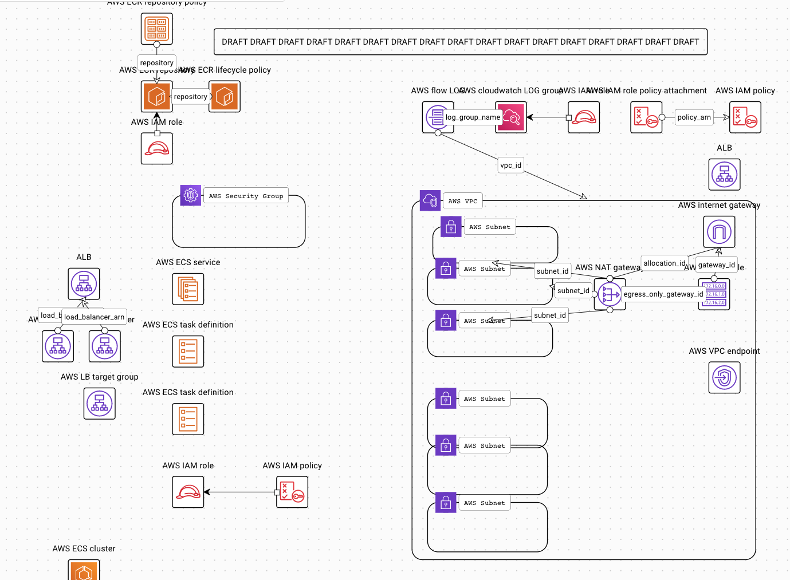

# Whiteboard Session
 - Draw a 3-tier web architecture diagram, for a LAMP(Linux Apache Mysql and PHP) application in AWS (very high level)

- Then, they’ll ask questions related to your diagram: What resources are required to implement this architecture in Terraform: VPC, Subnets, Routing tables, ALBs, Targetgroups, Security Groups

# Architecture


# Code layout
```console
src/terraform                                   # 
├── env                                         # Environments ( dev, staging, prod etc. ) & settings / variables
│   ├── dev                                     # 
│   │   └── terragrunt.hcl                      # Use Terragrunt for DRY
│   └── prod                                    # 
│       ├── provider.tf                         # 
│       └── terragrunt.hcl                      # 
├── modules                                     # Terraform modules, no Terragrunt for portability
│   ├── demo-app                                # Module for Fargate demo app
│   │   ├── README.md                           # 
│   │   ├── data.tf                             # 
│   │   ├── main.tf                             # 
│   │   ├── outputs.tf                          # 
│   │   ├── turnerlabs                          # 
<snip>                                          # 
│   │   └── variables.tf                        # 
│   ├── ecr-repo                                # Module for ECR container repository
│   │   ├── data.tf                             # 
│   │   ├── files                               # 
│   │   │   └── ecr-principle-assume-role.json  # 
│   │   ├── main.tf                             # 
│   │   ├── outputs.tf                          # 
│   │   └── variables.tf                        # 
│   └── network                                 # Module for VPC and network
│       ├── data.tf                             # 
│       ├── main.tf                             # 
│       ├── outputs.tf                          # 
│       └── variables.tf                        # 
├── stacks                                      # Assemble different combinations of modules for differnt deployment requirements
│   ├── full                                    # Deploy everything
│   │   ├── terraform.tf                        # 
│   │   └── variables.tf                        # 
│   ├── lite                                    # VPC, Hostedzone, certs etc. already deployed
│   └── terragrunt.hcl                          # 
└── terragrunt.hcl                              # Use terragrunt for DRY


```

# AWS Resources
- [x] Added to diagram
## Network Module
 - [x] module.network.module.vpc.aws_cloudwatch_log_group.flow_log[0]
 - [x] module.network.module.vpc.aws_eip.nat[0]
 - [x] module.network.module.vpc.aws_flow_log.this[0]
 - [x] module.network.module.vpc.aws_iam_policy.vpc_flow_log_cloudwatch[0]
 - [x] module.network.module.vpc.aws_iam_role.vpc_flow_log_cloudwatch[0]
 - [x] module.network.module.vpc.aws_iam_role_policy_attachment.vpc_flow_log_cloudwatch[0]
 - [x] module.network.module.vpc.aws_internet_gateway.this[0]
 - [x] module.network.module.vpc.aws_nat_gateway.this[0]
 - [x] module.network.module.vpc.aws_route.private_nat_gateway[0]
 - [ ] module.network.module.vpc.aws_route.public_internet_gateway[0]
 - [ ] module.network.module.vpc.aws_route_table.private[0]
 - [ ] module.network.module.vpc.aws_route_table.public[0]
 - [ ] module.network.module.vpc.aws_route_table_association.private[0]
 - [ ] module.network.module.vpc.aws_route_table_association.private[1]
 - [ ] module.network.module.vpc.aws_route_table_association.private[2]
 - [ ] module.network.module.vpc.aws_route_table_association.public[0]
 - [ ] module.network.module.vpc.aws_route_table_association.public[1]
 - [ ] module.network.module.vpc.aws_route_table_association.public[2]
 - [x] module.network.module.vpc.aws_subnet.private[0]
 - [x] module.network.module.vpc.aws_subnet.private[1]
 - [x] module.network.module.vpc.aws_subnet.private[2]
 - [x] module.network.module.vpc.aws_subnet.public[0]
 - [x] module.network.module.vpc.aws_subnet.public[1]
 - [x] module.network.module.vpc.aws_subnet.public[2]
 - [x] module.network.module.vpc.aws_vpc.this[0]
 - [x] module.network.module.vpc.aws_vpc_endpoint.s3[0]
 - [x] module.network.module.vpc.aws_vpc_endpoint_route_table_association.private_s3[0]
 - [x] module.network.module.vpc.aws_vpc_endpoint_route_table_association.public_s3[0]
 
## ECR Repo Module
 - [x] module.ecr_repo.aws_iam_role.ecr_principle
 - [x] module.ecr_repo.module.ecr_repo.aws_ecr_lifecycle_policy.name["demoapp-dev-dev-demoapp"]
 - [x] module.ecr_repo.module.ecr_repo.aws_ecr_repository.name["demoapp-dev-dev-demoapp"]
 - [x] module.ecr_repo.module.ecr_repo.aws_ecr_repository_policy.name["demoapp-dev-dev-demoapp"]

# Demo-App Module
- [x] module.demo_app.module.fargate.aws_alb.main
- [x] module.demo_app.module.fargate.aws_alb_listener.http
- [x] module.demo_app.module.fargate.aws_alb_listener.https
- [x] module.demo_app.module.fargate.aws_alb_target_group.main
- [ ] module.demo_app.module.fargate.aws_appautoscaling_policy.app_down
- [ ] module.demo_app.module.fargate.aws_appautoscaling_policy.app_up
- [ ] module.demo_app.module.fargate.aws_appautoscaling_scheduled_action.app_autoscale_time_down
- [ ] module.demo_app.module.fargate.aws_appautoscaling_scheduled_action.app_autoscale_time_up
- [ ] module.demo_app.module.fargate.aws_appautoscaling_target.app_scale_target
- [ ] module.demo_app.module.fargate.aws_cloudwatch_dashboard.cloudwatch_dashboard
- [ ] module.demo_app.module.fargate.aws_cloudwatch_dashboard.ecs-event-stream
- [ ] module.demo_app.module.fargate.aws_cloudwatch_event_rule.ecs_event_stream
- [ ] module.demo_app.module.fargate.aws_cloudwatch_event_target.ecs_event_stream
- [ ] module.demo_app.module.fargate.aws_cloudwatch_log_group.logs
- [ ] module.demo_app.module.fargate.aws_cloudwatch_metric_alarm.cpu_utilization_high
- [ ] module.demo_app.module.fargate.aws_cloudwatch_metric_alarm.cpu_utilization_low
- [x] module.demo_app.module.fargate.aws_ecs_cluster.app
- [ ] module.demo_app.module.fargate.aws_ecs_service.app
- [ ] module.demo_app.module.fargate.aws_ecs_task_definition.app
- [ ] module.demo_app.module.fargate.aws_iam_role.app_role
- [ ] module.demo_app.module.fargate.aws_iam_role.ecsTaskExecutionRole
- [ ] module.demo_app.module.fargate.aws_iam_role.ecs_event_stream
- [ ] module.demo_app.module.fargate.aws_iam_role_policy.app_policy
- [ ] module.demo_app.module.fargate.aws_iam_role_policy_attachment.ecsTaskExecutionRole_policy
- [ ] module.demo_app.module.fargate.aws_iam_role_policy_attachment.ecs_event_stream
- [ ] module.demo_app.module.fargate.aws_lambda_alias.ecs_event_stream
- [ ] module.demo_app.module.fargate.aws_lambda_function.ecs_event_stream
- [ ] module.demo_app.module.fargate.aws_lambda_permission.ecs_event_stream
- [ ] module.demo_app.module.fargate.aws_s3_bucket.lb_access_logs
- [ ] module.demo_app.module.fargate.aws_s3_bucket_policy.lb_access_logs
- [ ] module.demo_app.module.fargate.aws_security_group.nsg_lb
- [ ] module.demo_app.module.fargate.aws_security_group.nsg_task
- [ ] module.demo_app.module.fargate.aws_security_group_rule.ingress_lb_http
- [ ] module.demo_app.module.fargate.aws_security_group_rule.ingress_lb_https
- [ ] module.demo_app.module.fargate.aws_security_group_rule.nsg_lb_egress_rule
- [ ] module.demo_app.module.fargate.aws_security_group_rule.nsg_task_egress_rule
- [ ] module.demo_app.module.fargate.aws_security_group_rule.nsg_task_ingress_rule


# Deploy

## Prerequisites
 - Terragrunt
 - Terraform
 
## Deploy Steps
Check AWS credentials
```shell script
aws sts get-caller-identity

```
 
```shell script
pushd src/terraform/env/dev
terragrunt init
teragrunt plan
terragrunt apply

```
